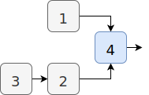
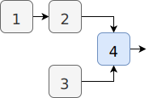
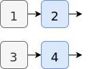
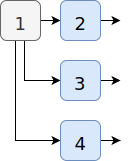
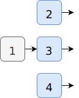
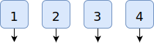

# Sega Mega Drive MIDI Interface [](https://circleci.com/gh/rhargreaves/mega-drive-midi-interface) [](https://github.com/rhargreaves/mega-drive-midi-interface/releases)

Control the Yamaha YM2612 and PSG chips of the SEGA Mega Drive via MIDI.

<p align="center">
    
</p>

## Features

- Built-in FM presets for General MIDI compatibility
- Supports MIDI 1.0 CCs & events (e.g. panning, volume, pitch bending)
- Polythonic support via FM channel pooling
- Connectivity via:
  - Mega Everdrive's X7 USB port
  - [Custom-built USB cable connected to a controller port](https://github.com/rhargreaves/mega-drive-serial-port#hardware).
- Fine-grained control of YM2612 registers via [GenMDM-style CCs](https://catskullelectronics.com/public/genMDM.pdf)

## Getting Started

### Hardware Requirements

- SEGA Mega Drive/Genesis Console (Model 1 or 2)

Either:

- [Mega EverDrive X7 cart](https://krikzz.com/store/home/33-mega-everdrive-v2.html)
- USB cable for connecting your PC to the EverDrive X7.

Or:

- Generic flash cart for loading the ROM
- USB serial cable for connectivity into Controller Port 2, [based on these specifications](https://github.com/rhargreaves/mega-drive-serial-port#hardware)

**Due to speed limitations on the controller port serial interface, EverDrive X7 USB connectivity is the recommended option, but connectivity via the controller port might be fine for simple use cases.**

### Software Requirements

- MIDI to serial port virtual device, e.g. [Hairless MIDI<->Serial Bridge](http://projectgus.github.io/hairless-midiserial/)
- Optional: MIDI loop device (so software running on the same PC as the USB connection can use the MIDI interface). In macOS this is possible via the use of a ["IAC Device Bus" creatable from the Audio MIDI Setup utility](https://help.ableton.com/hc/en-us/articles/209774225-Using-virtual-MIDI-buses).

### Download

You can download pre-built ROMs from [releases](https://github.com/rhargreaves/mega-drive-midi-interface/releases).

## Build & Test

Unit & system tests are compiled and ran as x86 binaries using CMocka. Mega Drive interfaces are mocked.

Docker:

```sh
./docker-make
```

Linux (requires `cmake` & [gendev](https://github.com/kubilus1/gendev)):

```sh
make
```

## FM Presets

Sending a MIDI program change (0xC) message will select a pre-defined FM preset.
The full list of presets available are defined in
[`presets.h`](https://github.com/rhargreaves/mega-drive-midi-interface/blob/master/src/presets.h). They are based on [Wohlstand's XG bank from libOPNMIDI](https://github.com/Wohlstand/libOPNMIDI/blob/master/fm_banks/xg.wopn). The interface defaults all FM channels to instrument 0 (Grand Piano) on start-up.

If MIDI channel 10 is mapped to an FM channel, the interface will make use of a separate bank of percussion instruments. An an example, to map MIDI channel 10 to FM channel 6, use the SysEx sequence `00 22 77 00 09 05`. Note that by default MIDI channel 10 is set to the PSG noise channel.

## Dynamic Mapping Mode

When dynamic mapping mode is enabled (SysEx `00 22 77 03 01`), MIDI channel note-on/off events are dynamically routed to free FM and PSG channels. That is, MIDI channels no-longer map directly onto device channels but are virtualised and note-on/off events and MIDI program data is set on the next available channel. This mode is best suited for playback of General MIDI files and makes full use of available YM2612/PSG capacity.

The following rules are used to determine which device channel receives the MIDI event:

1. FM channels 1 - 6 and PSG channels 1 - 3 (device channels) are included in the pool of available channels.
   The first available channel is assigned the first MIDI note on event. Future events are sent to this channel.
2. On subsequent events, if the note is already playing on that channel, the next available device channel is used.
3. The following MIDI parameters are automatically set on any mapped device channels:
   - Program
   - Volume
   - Pan

### Polyphonic Mode

When polyphonic mode is enabled (CC 80), dynamic mapping mode is enabled and MIDI channel 1 is mapped to FM channels 1-6. This allows for polyphony within a single MIDI channel. In addition, any FM parameter change made will be sent to all FM channels. If all channels are busy, the note on event is dropped.

## MIDI Message Reference

### Channel Mappings

By default, MIDI channels are assigned in a static, one-to-one arrangement to FM or PSG channels as follows:

| Channels | Assignment                  |
| -------- | --------------------------- |
| 1 - 6    | YM2612 FM Channels 1 - 6    |
| 7 - 9    | PSG Square Wave Tones 1 - 3 |
| 10       | PSG Noise Channel           |

You can also [re-configure the MIDI mappings](#system-exclusive) via SysEx

### Events

- Note On/Off
- Pitch Bend
- Program Change (FM only: selects preset)
- Universal SysEx Messages

### Common MIDI CCs

These are supported across FM and PSG channels:

| CC  | Description           | Effect                                                                 | Values                                             |
| --- | --------------------- | ---------------------------------------------------------------------- | -------------------------------------------------- |
| 7   | Channel Volume        | Output Operator Total Level (FM),<br/>Attenuation (PSG)                | 0 - 127: [Logarithmic](src/midi.c#L24)             |
| 10  | Panning               | Stereo                                                                 | 0 - 31: Left<br>32 - 95: Centre<br>96 - 127: Right |
| 120 | All Sounds Off        | Same as CC 123                                                         | Any                                                |
| 121 | Reset All Controllers | Reset MIDI parameters and dynamic channel mappings (dynamic mode only) | Any                                                |
| 123 | All Notes Off         | Key Off (FM),<br/>Max. Attenuation (PSG)                               | Any                                                |

### FM Parameters

These only apply to channels mapped to FM channels:

#### Global

| Description       | CC  | Range\* |
| ----------------- | --- | ------- |
| LFO Enable        | 74  | 2       |
| LFO Frequency     | 1   | 8       |
| Polyphonic Mode\* | 80  | 2       |

_Range determines how the possible 128 MIDI values are divided to give the respective YM2612 register value, using the formula `_midiValue / (128 / range) = registerValue` (e.g. MIDI value of 32, with a range of 8 translates into to a YM2612 register value of 2)_

#### Per Channel

| Parameter                        | CC  | Range |
| -------------------------------- | --- | ----- |
| Algorithm                        | 14  | 8     |
| Feedback                         | 15  | 8     |
| Frequency Modulation Level (FMS) | 75  | 8     |
| Amplitude Modulation Level (AMS) | 76  | 4     |
| Stereo                           | 77  | 4     |

#### Per Channel & Operator

| Parameter                 | Op 1<br/>CC | Op 2<br/>CC | Op 3<br/>CC | Op 4<br/>CC | Range |
| ------------------------- | ----------- | ----------- | ----------- | ----------- | ----- |
| Total Level (TL)          | 16          | 17          | 18          | 19          | 128   |
| Multiple (MUL)            | 20          | 21          | 22          | 23          | 16    |
| Detune (DT1)              | 24          | 25          | 26          | 27          | 8     |
| Rate Scaling (RS)         | 39          | 40          | 41          | 42          | 4     |
| Attack Rate (AR)          | 43          | 44          | 45          | 46          | 32    |
| First Decay Rate (D1R)    | 47          | 48          | 49          | 50          | 32    |
| Second Decay Rate (D2R)   | 51          | 52          | 53          | 54          | 16    |
| Secondary Amplitude (D1L) | 55          | 56          | 57          | 58          | 16    |
| Release Rate (RR)         | 59          | 60          | 61          | 62          | 16    |
| Amplitude Modulation (AM) | 70          | 71          | 72          | 73          | 2     |
| SSG-EG                    | 90          | 91          | 92          | 93          | 16    |

### FM Algorithm Operator Routing

Output operators are coloured blue. Operator 1 can also feedback into itself (see CC 15). Operators are numbered in the same order as the register placement (e.g. 0x30, 0x34, 0x38, 0x3C).

| Algorithm | Operator Arrangement                |
| --------- | ----------------------------------- |
| 0         |  |
| 1         |  |
| 2         |  |
| 3         |  |
| 4         |  |
| 5         |  |
| 6         |  |
| 7         |  |

_Note: Documentation on the YM2612 frequently muddles the second and third operators of algorithms 0 to 4 and 6. This is likely due to the original SEGA documentation incorrectly labelling the operator register addresses in sequential order, rather than 1st, 3rd, 2nd, 4th. That said, it seems to be generally common to keep the sequential order of the register addresses and simply correct the layout diagrams. This project favours this approach._

### System Real-Time Messages

| Status | Description           | Effect                 |
| ------ | --------------------- | ---------------------- |
| 0xF2   | Song Position Pointer | Set Beat Counter       |
| 0xF8   | Timing Clock          | Increment Beat Counter |
| 0xFA   | Start                 | Reset Beat Counter     |
| 0xFB   | Continue              | None                   |
| 0xFC   | Stop                  | None                   |

## Configuration & Advanced Operations

The interface is configurable by sending specific System Exclusive messages to the Mega Drive. There are also a number of advanced operations which have a specific effect when received. A list of all possible SysEx messages are given below:

| Name                            | SysEx Sequence      | Description                                                                                                                                                                                        |
| ------------------------------- | ------------------- | -------------------------------------------------------------------------------------------------------------------------------------------------------------------------------------------------- |
| General MIDI Reset              | `7E 7F 09 01`       | Force all notes off on all channels and resets all MIDI channel mappings.                                                                                                                          |
| Remap MIDI Channel              | `00 22 77 00 xx yy` | Remap MIDI channel _xx_ to device channel _yy_<br/>_xx_ = MIDI channel (0-15), unassigned (127)<br/>_yy_ = FM (0-5), PSG (6-9), unassigned (127)                                                   |
| Ping                            | `00 22 77 01`       | Interface responds with a _pong_ SysEx reply (`00 22 77 02`). Intended for use in measuring MIDI round-trip latency.                                                                               |
| Dynamic Channelling Mode        | `00 22 77 03 xx`    | Dynamically assigns MIDI channels to idle FM/PSG channels to allow for maximum polyphony and variation in instrumentation.<br/>_xx_ = Enable (01) / Disable (00)                                   |
| Non-General MIDI CCs            | `00 22 77 04 xx`    | Respond to non-General MIDI CCs.<br/>_xx_ = Enable (01) / Disable (00)                                                                                                                             |
| Polyphony Sticks to Device Type | `00 22 77 05 xx`    | MIDI channel polyphony will stick to originally assigned device type (FM or PSG). Enable for consistent voicing, but disable to allow for maximum polyphony.<br/>_xx_ = Enable (01) / Disable (00) |

## Performance

Releases are tested for performance using the [Mega MIDI Ping Pong](https://github.com/rhargreaves/mega-midi-ping-pong) tool which makes use of the "Ping" SysEx message to measure round-trip time.

[Test results](https://github.com/rhargreaves/mega-midi-ping-pong#results)

## Stretch Goals

- Support for MIDI messages to be received via the controller ports (in serial mode) as an alternative to the EverDrive X7.
- Support for loading & playback of PCM samples.

## Contributions

Pull requests are welcome, as are donations!

[](https://www.paypal.com/cgi-bin/webscr?cmd=_s-xclick&hosted_button_id=4VY6LCUMYLD42&source=url)
